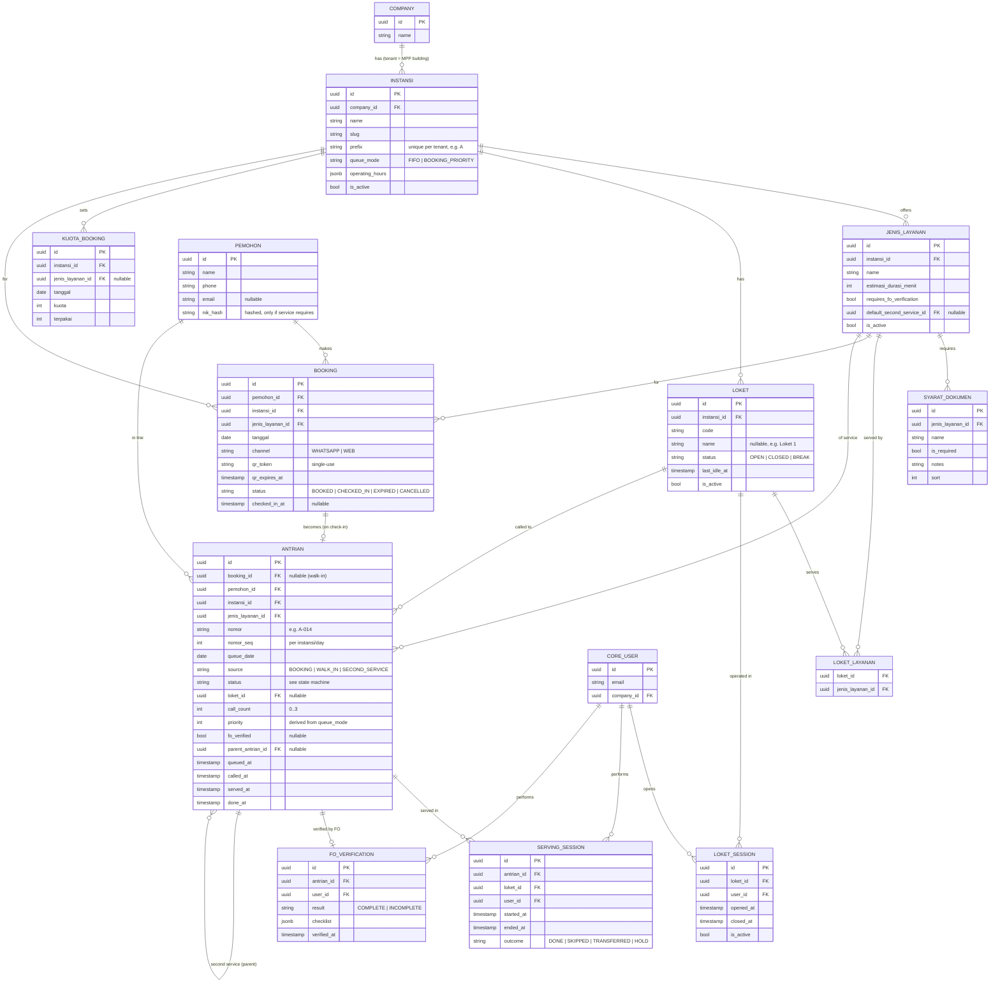

# Entity-Relationship Diagram — MPP _(EN)_

Schema `mpp` (queue domain) referencing `core` (users/companies from the skeleton).
See [`domain-model.md`](./domain-model.md) for field-level detail.

## Indexing notes

- `antrian`: composite index on (`jenis_layanan_id`, `status`, `nomor_seq`) for the
  waiting stream (one stream per service); index on (`loket_id`, `status`); **unique on
  (`instansi_id`, `queue_date`, `nomor_seq`)** — the number series is per-agency (shared
  prefix), so uniqueness is per instansi/day, not per service.
- `kuota_booking`: unique (`instansi_id`, `jenis_layanan_id`, `tanggal`).
- `booking`: unique `qr_token`; index (`status`, `tanggal`).
- `instansi`: unique (`company_id`, `prefix`) and (`company_id`, `slug`).
