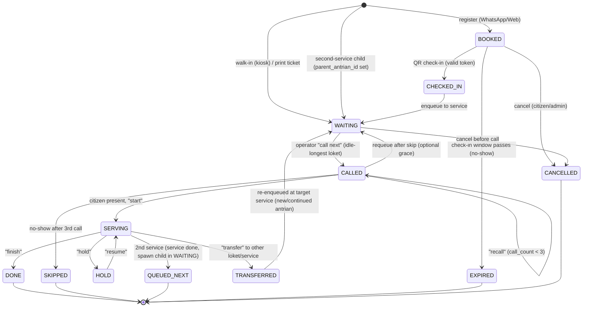

# Queue State Machine — `booking` & `antrian` lifecycle _(EN)_

Registration moves through **two separate status fields** backed by two DB enums.
Do not conflate them: a `booking` row and the `antrian` row it produces each carry their
own status. Illegal transitions are rejected server-side (NFR-DATA-03).

## Booking states (`mpp.booking_status`)

Pre-queue lifecycle, lives on the `booking` row (WhatsApp/Web registrations only;
walk-ins have no booking).

| State        | Meaning |
|--------------|---------|
| `BOOKED`     | Scheduled via WhatsApp/Web; awaiting on-site check-in. |
| `CHECKED_IN` | QR checked-in at kiosk; an `antrian` row is created and enters the active queue. |
| `EXPIRED`    | Not checked-in within the allowed window (no-show before queue). |
| `CANCELLED`  | Cancelled by citizen/admin before check-in. |

## Antrian states (`mpp.antrian_status`)

Active-queue lifecycle, lives on the `antrian` row (created at check-in **or** walk-in).
Note `CHECKED_IN` and `EXPIRED` are **booking** states, **not** antrian states.

| State         | Meaning |
|---------------|---------|
| `WAITING`     | In the active queue for its service, not yet called. |
| `CALLED`      | Announced (TV + TTS) to a specific loket; awaiting the citizen to approach. |
| `SERVING`     | Being served at the loket. |
| `HOLD`        | Temporarily paused mid-service (e.g. citizen fetching a document). |
| `DONE`        | Service completed. |
| `SKIPPED`     | Called up to 3× with no-show → skipped. |
| `TRANSFERRED` | Moved to another loket/service (a new/continued antrian results). |
| `QUEUED_NEXT` | **Terminal for this antrian.** Service completed and a second-service child antrian was spawned (see Second service below). |
| `CANCELLED`   | Cancelled by citizen/admin before serving. |

`CANCELLED` exists in **both** enums (a booking can be cancelled pre-check-in; an antrian
can be cancelled pre-serving).

## Diagram

## Transition table

| From | Event / Action | To | Guard / Effect |
|------|----------------|----|----------------|
| `BOOKED` | Valid QR check-in | `CHECKED_IN` | token unused & not expired & correct day; mark `booking.status=CHECKED_IN`; print ticket |
| `BOOKED` | Check-in window elapses | `EXPIRED` | scheduled job; counts as no-show; frees nothing (quota already consumed for the day) |
| `BOOKED` | Cancel | `CANCELLED` | decrement `kuota_booking.terpakai` if before cutoff |
| `CHECKED_IN` | Enqueue | `WAITING` | assign `nomor`/`nomor_seq` (atomic Redis INCR); set `queued_at`; broadcast |
| walk-in | Kiosk register | `WAITING` | create `antrian` (source `WALK_IN`); assign number; print ticket |
| `WAITING` | Call next | `CALLED` | pick idle-longest eligible loket; set `loket_id`, `called_at`, `call_count=1`; broadcast + TTS |
| `CALLED` | Recall | `CALLED` | `call_count += 1` (≤3); re-broadcast + TTS |
| `CALLED` | Start | `SERVING` | open `serving_session`; set `served_at`; update loket busy |
| `CALLED` | No-show (after 3rd) | `SKIPPED` | close as no-show; loket freed → `last_idle_at=now` |
| `CALLED` | Requeue (grace) | `WAITING` | optional: put back to end of queue instead of skipping |
| `SERVING` | Hold | `HOLD` | pause session; loket may serve others per policy |
| `HOLD` | Resume | `SERVING` | continue same session |
| `SERVING` | Finish | `DONE` | close `serving_session` (outcome DONE); set `done_at`; loket `last_idle_at=now`; broadcast |
| `SERVING` | Transfer | `TRANSFERRED` | close session (outcome TRANSFERRED); create/continue target `antrian` → `WAITING` |
| `SERVING` | Second service | `QUEUED_NEXT` | close this `serving_session` with outcome `DONE` (the first service *is* completed); set antrian → `QUEUED_NEXT` (**terminal for the parent**); create a **child** `antrian` (`source=SECOND_SERVICE`, `parent_antrian_id` set) directly in `WAITING` at the target service; no re-registration |
| `WAITING`/`CALLED` | Cancel | `CANCELLED` | admin/citizen; broadcast |

## Notes

- **`call_count` cap = 3** enforces the "call 3× then skip" rule (FR-OPR-03).
- On **`DONE`/`SKIPPED`/`TRANSFERRED`**, the loket's `last_idle_at` is refreshed so the
  idle-longest allocator (FR-QUE-02) picks fairly.
- **Daily reset (00:00)**: number counters reset. Any leftover `WAITING`/`CALLED`/`HOLD`
  antrian from the prior day are, by default, moved to `CANCELLED` (there is no `EXPIRED`
  antrian status — `EXPIRED` is a *booking* state). The reset behavior is admin-configurable
  (`system_config` key `daily_reset`, see business rules BR-03).
- **Second service** keeps the same `pemohon`. The parent antrian ends `QUEUED_NEXT`
  (its `serving_session` closed `DONE`, so reporting still counts the first service as
  served); the child is a fresh `antrian` in the target service's stream, starting at
  `WAITING`, linked via `parent_antrian_id` for reporting.
